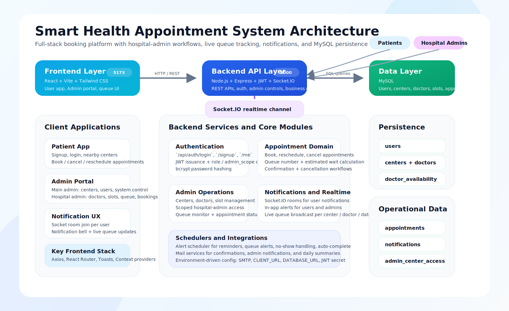

# Smart Health System Documentation

## Overview
Smart Health is a full-stack healthcare appointment booking platform designed for patients, main admins, and hospital admins. The system supports appointment booking, doctor slot management, hospital-scoped administration, live queue monitoring, notifications, and email alerts.

## Tech Stack

### Frontend
- React
- Vite
- Tailwind CSS
- Axios
- React Router
- Socket.IO Client
- React Hot Toast

### Backend
- Node.js
- Express.js
- Socket.IO
- JWT Authentication
- bcryptjs
- express-validator
- Nodemailer

### Database
- MySQL

### Environment / Configuration
- `.env` based configuration
- `DATABASE_URL` or `DB_*` variables
- `JWT_SECRET`
- `CLIENT_URL`
- SMTP configuration for email delivery

## Core Modules

### User Module
- User registration and login
- Profile management
- Browse hospitals and doctors
- Book, cancel, and reschedule appointments
- View appointment history and live queue

### Admin Module
- Main admin can manage:
- hospitals / centers
- doctors
- users
- hospital admin creation and authorization
- full appointment system

### Hospital Admin Module
- Manage only assigned hospitals
- Add and edit doctors
- Update doctor specialization and qualifications
- Configure doctor availability slots
- Monitor bookings and queue flow
- Receive scoped notifications for relevant bookings and cancellations

### Notification Module
- In-app notifications
- Socket-based real-time updates
- Email notifications for appointments and admin events
- Queue alerts and reminders

### Scheduler Module
- Upcoming appointment reminders
- Queue alerts
- Auto-complete logic
- No-show handling
- Daily admin summaries

## Workflow

### 1. Patient Workflow
1. User signs up or logs in.
2. User browses available centers and doctors.
3. User selects a doctor and available slot.
4. System creates an appointment with:
- queue number
- patients before count
- estimated wait time
5. User receives confirmation through the app and email.
6. User can track status, reschedule, or cancel later.

### 2. Main Admin Workflow
1. Main admin logs in through the admin portal.
2. Main admin manages hospitals, doctors, users, and appointments.
3. Main admin creates hospital admin accounts and assigns hospitals.
4. Main admin monitors queue status and overall platform operations.

### 3. Hospital Admin Workflow
1. Hospital admin logs in with scoped access.
2. Hospital admin sees only assigned hospitals.
3. Hospital admin adds doctors and updates:
- specialization
- qualifications
- consultation duration
- availability slots
4. Hospital admin manages hospital appointments and queue status.
5. Hospital admin receives notifications for bookings and cancellations related to assigned hospitals.

### 4. Appointment Processing Workflow
1. Appointment request reaches backend API.
2. Backend validates user, doctor, slot, and date.
3. Queue metrics are calculated.
4. Appointment is stored in MySQL.
5. Notification and email services are triggered.
6. Socket events update live queue subscribers.

### 5. Notification Workflow
1. Backend creates notification records in MySQL.
2. Socket.IO emits notification events to the correct user room.
3. Frontend notification context updates the notification bell and UI.
4. Email notifications are sent for major actions when configured.

## Architecture Diagram

## High-Level Architecture Summary
- The React frontend provides separate experiences for patients and admins.
- The Express backend handles authentication, business logic, admin controls, notifications, and queue processing.
- MySQL stores users, centers, doctors, availability, appointments, notifications, and hospital-admin access mappings.
- Socket.IO enables real-time queue and notification updates.
- Mail services and schedulers support reminders, alerts, and operational summaries.

## Main Data Entities
- `users`
- `centers`
- `doctors`
- `doctor_availability`
- `appointments`
- `notifications`
- `admin_center_access`

## API Groups
- Auth APIs
- Profile APIs
- Center APIs
- Doctor APIs
- Appointment APIs
- Admin APIs
- Notification APIs

## Deployment Notes

### Frontend
- Build with `npm run build`
- Deploy `frontend/dist`

### Backend
- Run with `npm start` or `npm run dev`
- Configure environment variables properly

### Database
- Use MySQL locally or a managed SQL-compatible service in deployment

## Documentation Assets
- Architecture image: [architecture-diagram.svg](./architecture-diagram.svg)
- Main project readme: [README.md](./README.md)
